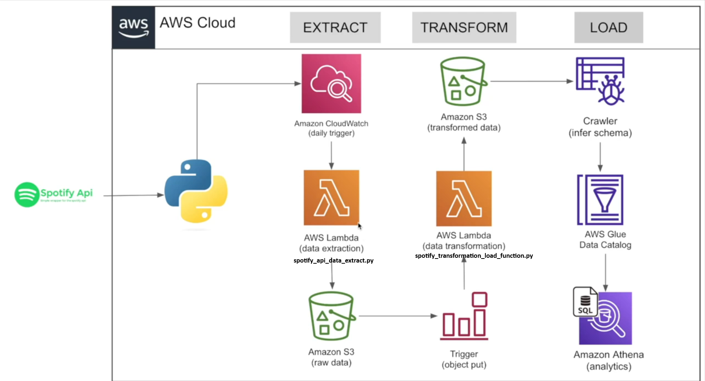

# **Scalable ETL Pipeline for Music Trends using Spotify API and AWS**

## Overview

This project is designed to build an ETL (Extract, Transform, Load) pipeline using Python for the Spotify API. The goal is to extract data about the top global songs from Spotify on a weekly basis, transform this data, and load it into AWS services for analysis. The project aims to help understand trends in the music industry by creating a comprehensive dataset over time.

## Table of Contents

- [Overview](#overview)
- [Architecture](#architecture)
- [Setup](#setup)
- [Project Structure](#project-structure)
- [Scripts](#scripts)
- [AWS Services Used](#aws-services-used)
- [Usage](#usage)
- [Contributing](#contributing)

## Architecture

The architecture of the ETL pipeline consists of various AWS services to ensure a serverless, scalable, and automated data pipeline. Below is a detailed architecture diagram and explanation of each component.



### Components

1. **Spotify API**:

   - Source of data for the top global songs, artists, and albums.
   - Data is extracted using the `spotipy` library in Python.
2. **Amazon CloudWatch**:

   - Schedules and triggers AWS Lambda functions on a daily or weekly basis.
3. **AWS Lambda (Data Extraction)**:

   - **Script**: `spotify_api_data_extract.py`
   - Extracts data from the Spotify API and stores it as raw data in Amazon S3.
4. **Amazon S3 (Raw Data)**:

   - Storage for raw data extracted from the Spotify API.
5. **Trigger (Object Put)**:

   - An S3 event trigger that invokes the AWS Lambda function for data transformation when new data is uploaded.
6. **AWS Lambda (Data Transformation)**:

   - **Script**: `spotify_transformation_load_function.py`
   - Transforms raw data and stores the transformed data back into Amazon S3.
7. **Amazon S3 (Transformed Data)**:

   - Storage for the transformed data ready for analysis.
8. **AWS Glue Crawler**:

   - Scans the data in S3, infers the schema, and creates a metadata catalog.
9. **AWS Glue Data Catalog**:

   - Metadata repository containing schema and table definitions for the data stored in S3.
10. **Amazon Athena**:

    - Allows running SQL queries directly on the data stored in S3 using the schema information from the Glue Data Catalog.

## Setup

### Prerequisites

- AWS Account
- AWS CLI configured
- Python 3.8+
- `pip` (Python package installer)
- `spotipy` library

## Project Structure

```
spotify-etl-pipeline/
├── data/
├── scripts/
│   ├── spotify_api_data_extract.py
│   ├── spotify_transformation_load_function.py
├── notebooks/
│   ├── Spotify Data Pipeline Project.ipynb
│   ├── spotify_api_data_extract_explained.ipynb
│   ├── spotify_transformation_load_function_explained.ipynb
├── README.md
```

## Scripts

### spotify_api_data_extract.py

- Extracts data from the Spotify API using `spotipy`.
- Stores the raw data in Amazon S3.
- Triggered by Amazon CloudWatch on a regular schedule.

### spotify_transformation_load_function.py

- Transforms the raw data into a structured format.
- Stores the transformed data in Amazon S3.
- Triggered by an S3 event when new raw data is uploaded.

## AWS Services Used

1. **Amazon S3**: Storage for raw and transformed data.
2. **AWS Lambda**: Serverless compute service to run the extraction and transformation scripts.
3. **Amazon CloudWatch**: Schedules and triggers Lambda functions.
4. **AWS Glue Crawler**: Scans data and creates metadata catalogs.
5. **AWS Glue Data Catalog**: Stores metadata information.
6. **Amazon Athena**: Allows querying data stored in S3 using SQL.

## Usage

1. **Deploy Lambda Functions**:

   - Package and deploy `spotify_api_data_extract.py` and `spotify_transformation_load_function.py` to AWS Lambda.
   - Ensure appropriate IAM roles and permissions.
2. **Schedule CloudWatch Events**:

   - Set up CloudWatch rules to trigger the data extraction Lambda function on a weekly basis.
3. **Configure S3 Triggers**:

   - Set up S3 triggers to invoke the data transformation Lambda function when new data is uploaded.
4. **Run Glue Crawler**:

   - Configure and run the AWS Glue Crawler to create metadata for the transformed data.
5. **Query Data with Athena**:

   - Use Amazon Athena to run SQL queries on the data for analysis.

## Contributing

Contributions are welcome! Please create a pull request or submit an issue for any improvements or bugs.

## DEMO

https://github.com/debjyotirshi2303/Scalable-ETL-Pipeline-for-Music-Trends-using-Spotify-API-and-AWS/assets/75799417/aac0d733-767c-4a50-8811-163c3a37cca3

